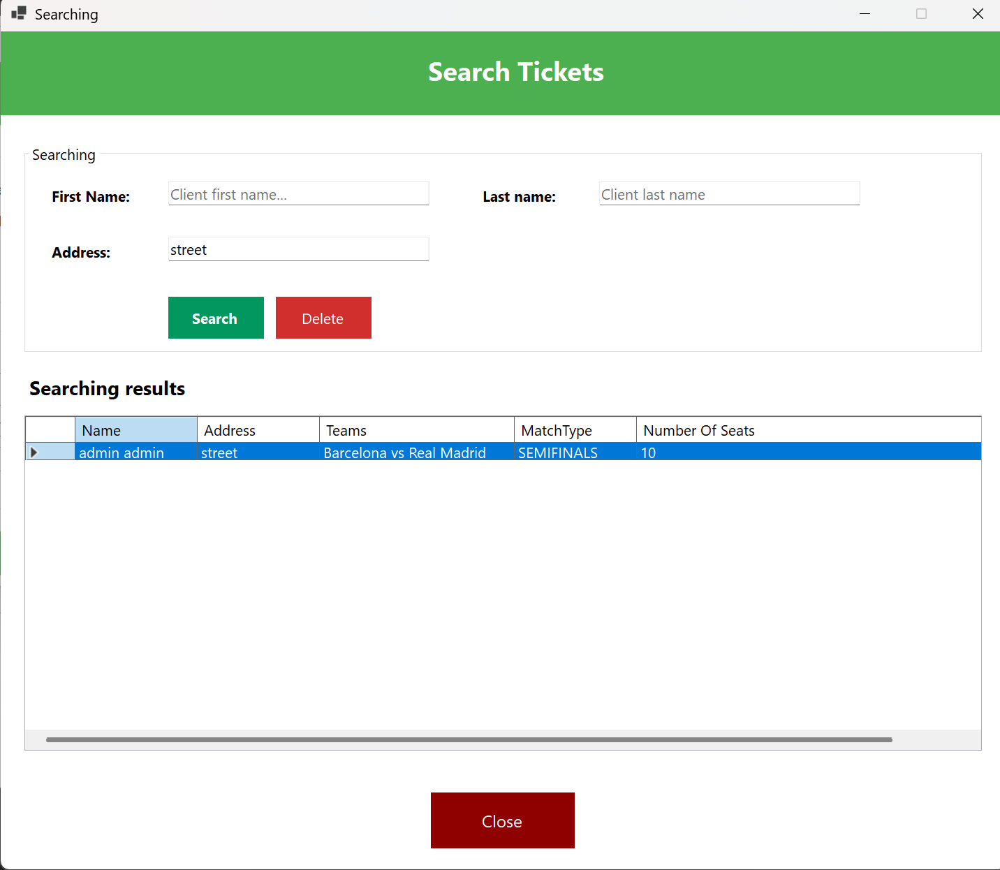
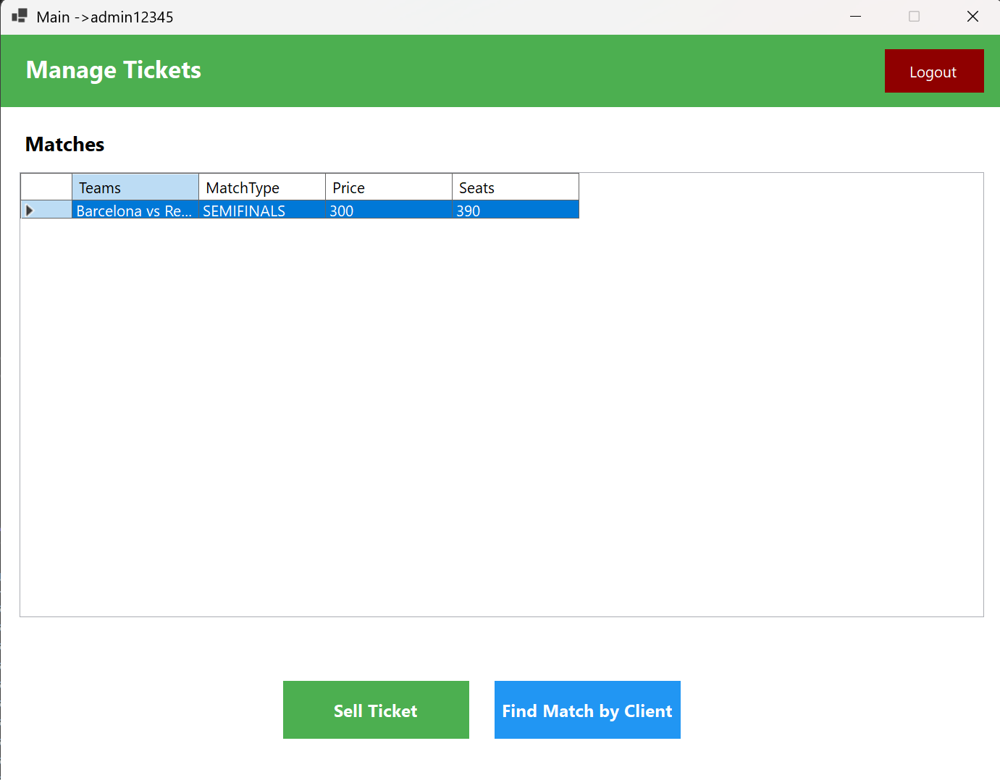
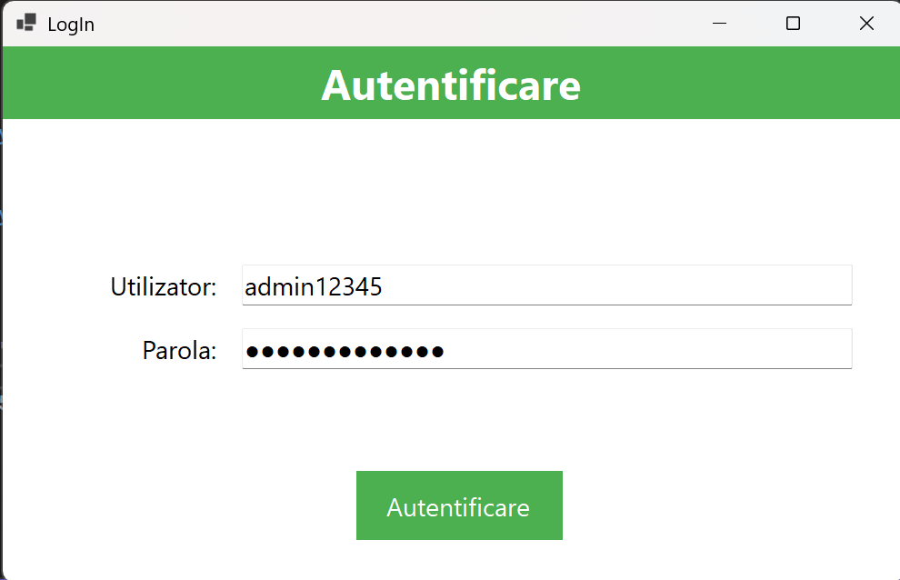
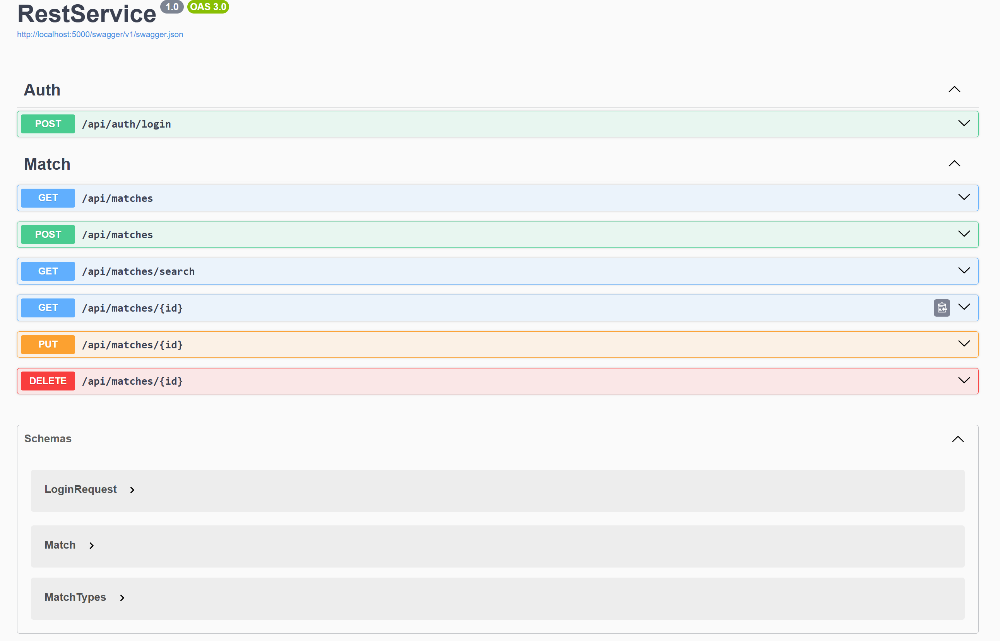
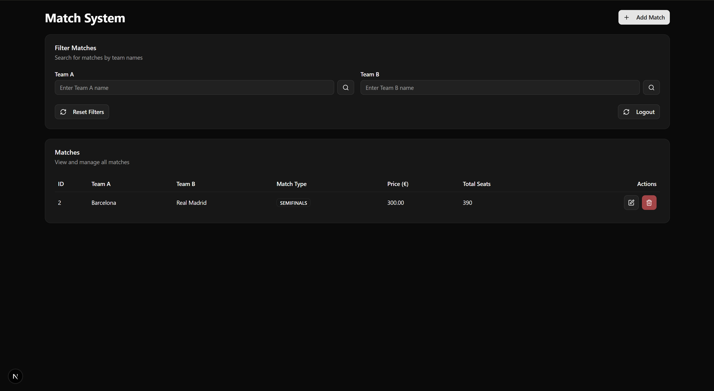
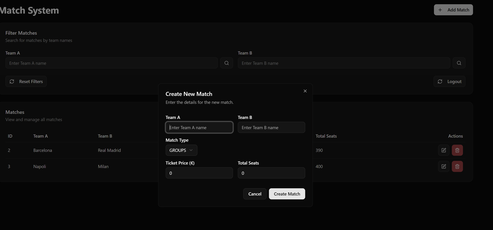
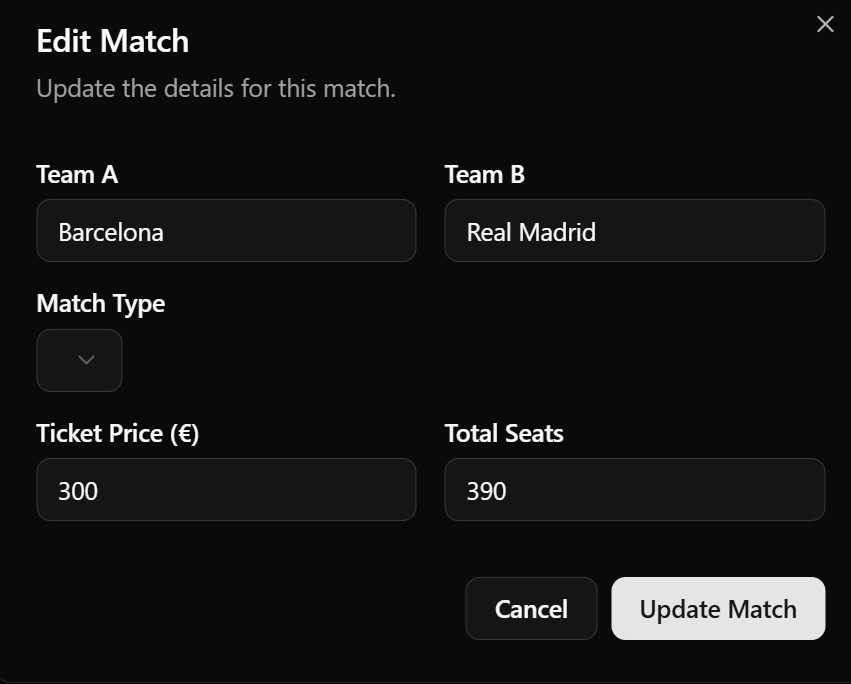

# 🏀 Ticketing System - C#

A desktop system for managing tickets to a basketball tournament.  The application provides secure authentication, ticket sales, search, and logout.  Connected clients receive live updates about seat availability.  
Match administration (CRUD) is handled through a separate Next.js web module.

---

## ✨ Main Features

### 🔑 Login
- Cashier authenticates with username & password (passwords stored using **BCrypt**).
- On success, the desktop application opens, showing the list of matches.

### 🎟️ Ticket Sales
- Sell tickets by entering **customer name**, **address**, and **number of seats**.
- All active clients instantly see updated seat availability (**Observer pattern with gRPC streaming**).
- Sold-out matches are marked in red.

### 🔍 Search
- Search tickets by **name** and/or **address**.
- If multiple customers share the same name → all tickets are displayed.
- Results include: customer, address, match, and seats.

### 🚪 Logout
- Session invalidation.
- Clean disconnection from the server.

### ⚙️ Match Management (Next.js)
- Web module for **CRUD operations** on matches: teams, stage (semifinal, final), price, capacity, date/time.
- Login with JWT token emitted

---

## 🧰 Tech Stack

- 💻 **Frontend Desktop:** C# **Windows Forms**  
- 🔙 **Backend:** gRPC + EF Core + SQLite  
- 🔐 **Auth:** JWT + BCrypt.Net  
- ⚡ **Async & Live Updates:** Task-based async + gRPC streaming (Observer/Proxy pattern)  
- 🌐 **Admin UI:** Next.js (pnpm) for match management  
- 🗄️ **ORM/DB:** EF Core, SQLite
- 📖 **API Documentation:** Swagger (OpenAPI)  

---

## 🖼️ Screenshots

<table>
  <tr>
    <td align="center">
       
    </td>
    <td align="center">
       
    </td>
    <td align="center">
       
    </td>
  </tr>
  <tr>
    <td align="center">
       
    </td>
    <td align="center">
       
    </td>
  </tr>
  <tr>
    <td align="center">
       
    </td>
    <td align="center">
       
    </td>
    <td align="center">
       
    </td>
  </tr>
</table>
